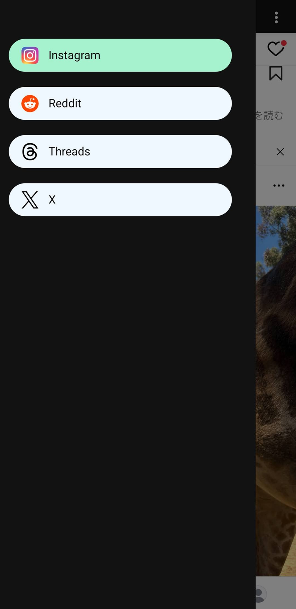
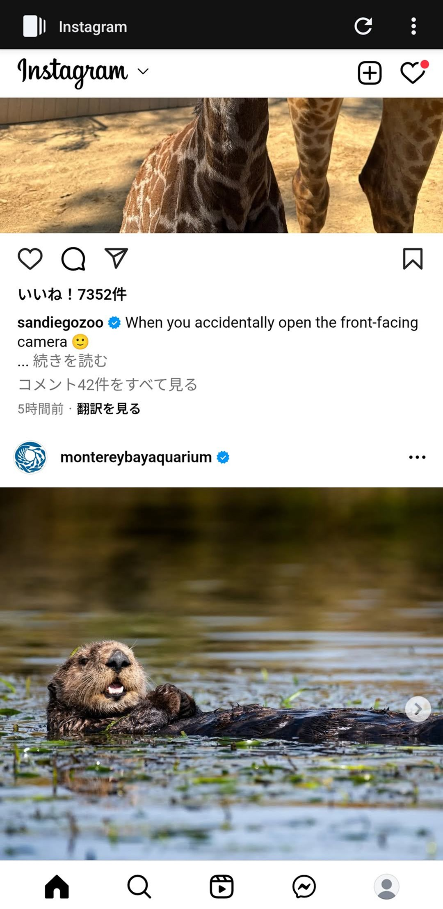
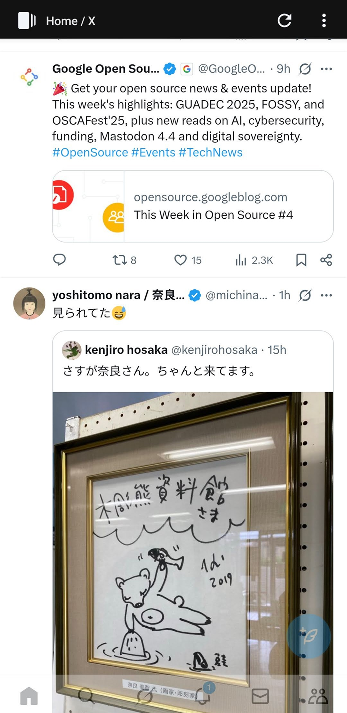

# Nora

Facebook, Instagram, Reddit, Threads and X in a single app. No ads.

[](https://f-droid.org/packages/jp.nonbili.nora/)
[](https://play.google.com/store/apps/details?id=jp.nonbili.nora)

Or download the latest APK from the [Releases Section](https://github.com/nonbili/Nora/releases/latest).

## Desktop version

Desktop version features a deck view to easily browse multiple timelines.
Desktop version shares the same code base with mobile version.
Download Linux/macOS/Windows version from [Nora-Desktop](https://github.com/nonbili/Nora-Desktop/releases).

## Features

- Download image
- Download fb/ig reel
- Select text
- Zoom
- Remove tracking url query params

## Supported SNS

- Bluesky
- Facebook
- Instagram
- LinkedIn
- Reddit
- Threads
- TikTok
- Tumblr
- VK
- X (Twitter)

## How it works

- Wrap the SNS websites in Android webview
- Inject code to block ads

## Screenshots

  

## Development

```
bun install
bun dev
bun run android
```
